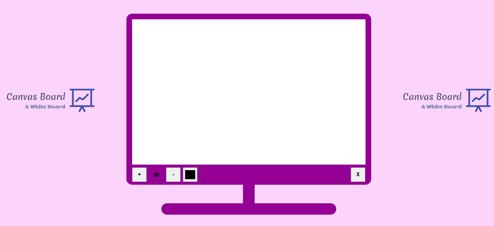
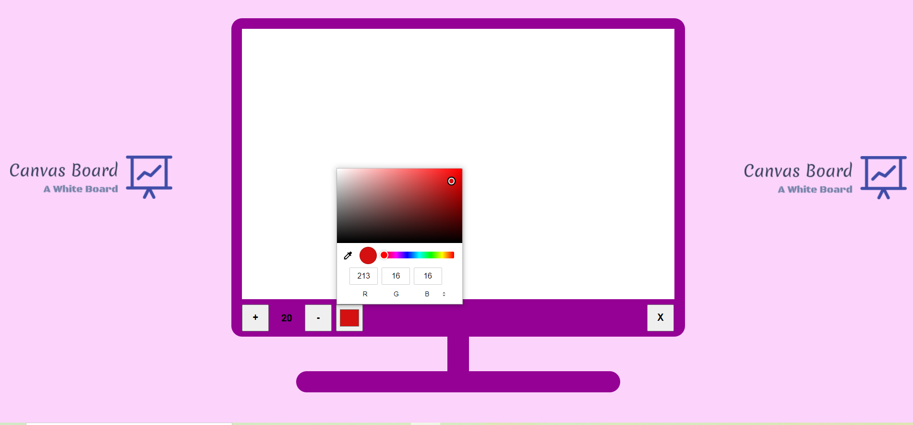
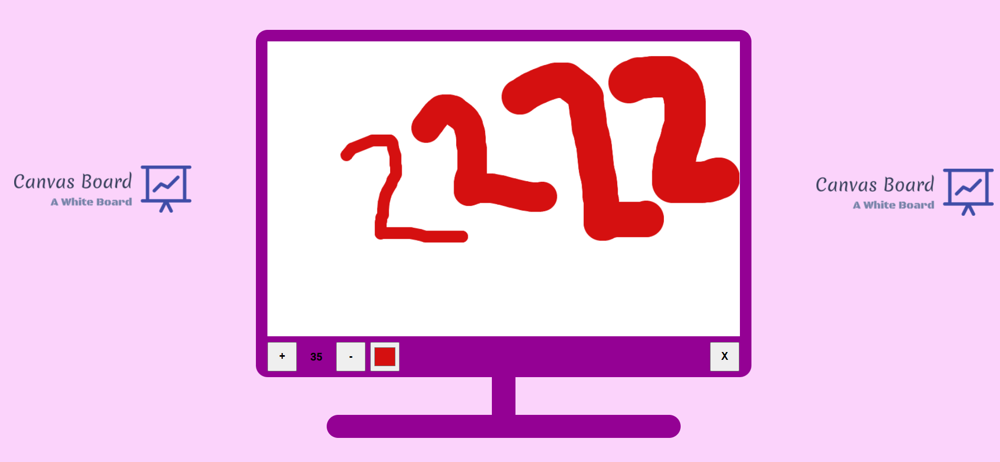

   
  
  
  

 

<h1> Canvas Drawing Board</h1>

This **webapp** is used to draw **free hand illustrations** in real time.
 

## ⚙ About
* It provides users with a platform to express their thoughts in a
pictorial form
* It gives users to have a gala time to enhance creativity.
* It allows users to create illustrations with variable size and with
various different colours.
* Any new creation can be started by simply clearing the previous one

 

## Process and Specifications
1. Open the Canvas Board Web Application
2. Select colour of your wish from the colour palette.
3. Choose the size of the drawing as your desire
4. Start Drawing.
5. Resize the drawing font and change the color anytime amid
the creation.

 

## User Interface

* Initial Interface:

*  Color Picker

* Pen Size Resizer

 